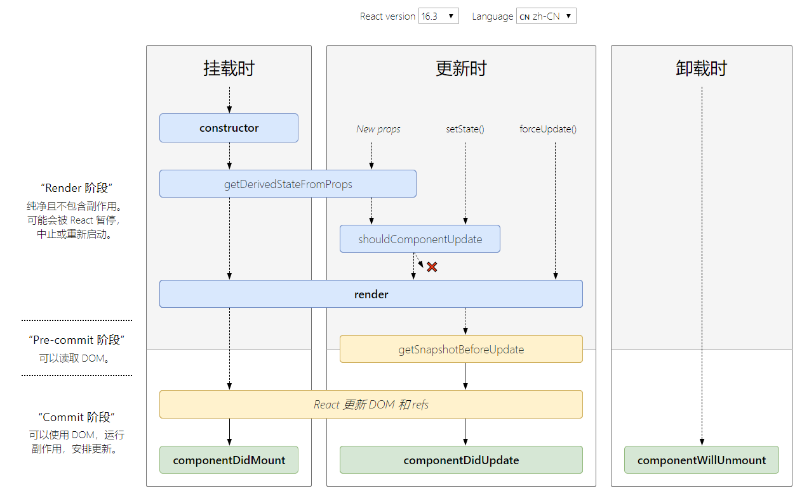
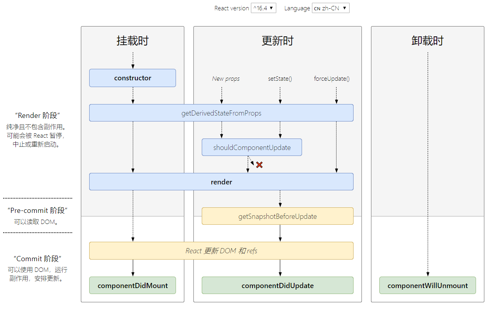

<!--
 * @Description: In User Settings Edit
 * @Author: your name
 * @Date: 2019-09-16 20:19:51
 * @LastEditTime: 2019-09-16 20:33:56
 * @LastEditors: Please set LastEditors
 -->
# React生命周期 

上图源于官网<http://projects.wojtekmaj.pl/react-lifecycle-methods-diagram/>

以上两张图分别展示了React 16.3,React 16.4^的生命周期图，下面我们再来一起仔细分析一下这个过程。

## 16.3

## 16.4
