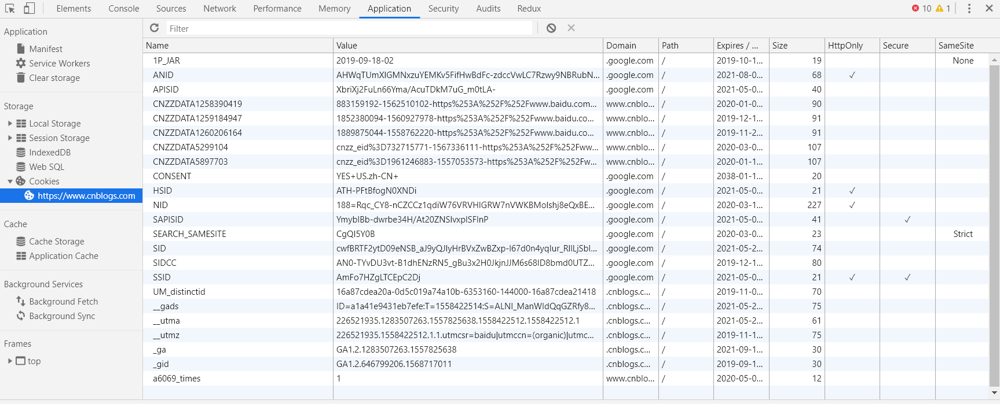

# Cookie

cookie属性详解

- 在chrome控制台中的resources选项卡中可以看到cookie的信息。

- cookie name,value  
  cookie，name ,value
- Expires=date  
cookie 的最长有效时间，形式为符合 HTTP-date 规范的时间戳。参考 Date 可以获取详细信息。如果没有设置这个属性，那么表示这是一个会话期 cookie 。一个会话结束于客户端被关闭时，这意味着会话期 cookie 在彼时会被移除。然而，很多Web浏览器支持会话恢复功能，这个功能可以使浏览器保留所有的tab标签，然后在重新打开浏览器的时候将其还原。与此同时，cookie 也会恢复，就跟从来没有关闭浏览器一样。

- Max-Age=non-zero-digit>  
在 cookie 失效之前需要经过的秒数。秒数为 0 或 -1 将会使 cookie 直接过期。一些老的浏览器（ie6、ie7 和 ie8）不支持这个属性。对于其他浏览器来说，假如二者 （指 Expires 和Max-Age） 均存在，那么 Max-Age 优先级更高。
- Domain=domain-value  
指定 cookie 可以送达的主机名。假如没有指定，那么默认值为当前文档访问地址中的主机部分（但是不包含子域名）。与之前的规范不同的是，域名之前的点号会被忽略。假如指定了域名，那么相当于各个子域名也包含在内了。
- Path=path-value  
指定一个 URL 路径，这个路径必须出现在要请求的资源的路径中才可以发送 Cookie 首部。字符  %x2F ("/") 可以解释为文件目录分隔符，此目录的下级目录也满足匹配的条件（例如，如果 path=/docs，那么 "/docs", "/docs/Web/" 或者 "/docs/Web/HTTP" 都满足匹配的条件）。
- Secure  
一个带有安全属性的 cookie 只有在请求使用SSL和HTTPS协议的时候才会被发送到服务器。然而，保密或敏感信息永远不要在 HTTP cookie 中存储或传输，因为整个机制从本质上来说都是不安全的，比如前述协议并不意味着所有的信息都是经过加密的。
注意：非安全站点（http:）已经不能再在 cookie 中设置 secure 指令了（在Chrome 52+ and Firefox 52+ 中新引入的限制）。

- HttpOnly  
设置了 HttpOnly 属性的 cookie 不能使用 JavaScript 经由  Document.cookie 属性、XMLHttpRequest 和  Request APIs 进行访问，以防范跨站脚本攻击（XSS）。
- SameSite  
允许服务器设定一则 cookie 不随着跨域请求一起发送，这样可以在一定程度上防范跨站请求伪造攻击（CSRF）。

**参考：**
- <https://developer.mozilla.org/zh-CN/docs/Web/HTTP/Headers/Set-Cookie>