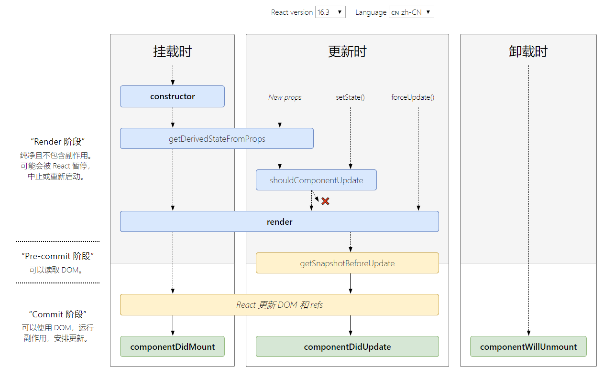
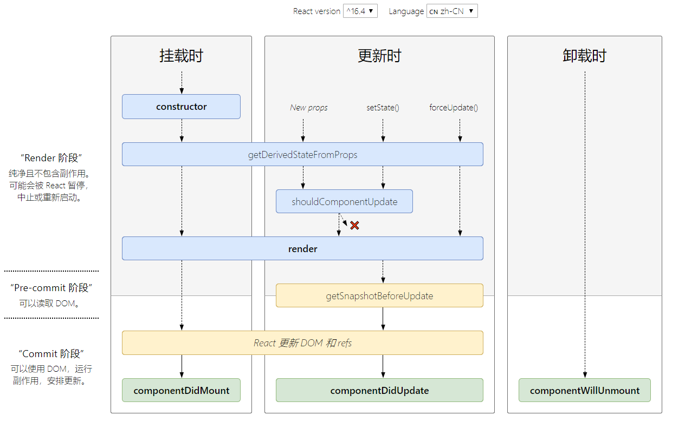

# React生命周期 

上图源于官网<http://projects.wojtekmaj.pl/react-lifecycle-methods-diagram/>

以上两张图分别展示了React 16.3,React 16.4^的生命周期图，下面我们再来一起仔细分析一下这个过程。

## 生命周期总览

  生命周期可以大致分为三个部分：
- Mount 第一次组件挂在到DOM上
- Update 组件state,props的变化引发的重新渲染
- UnMount 组件从DOM树上删除
## 16.3

### Mount
 - constructor 初始化state，绑定本地this，
 - componentWillMount 预装载，此处不能修改state，做了也不会更新
 - render 渲染函数，唯一不能省略的函数。根据this.state,this.props的不同来进行渲染的函数。不能在函数中进行修改this.state,this.props,拉去数据等副作用操作。他一个仅仅用于渲染的纯函数。render 返回 JSX对象。何时进行渲染，将挂载到DOM上是由React决定的。
 - componentDidMount 挂载成功的函数。 render仅仅返回JSX对象，没有立即被挂载到DOM上，componentDidMount在已经挂载到DOM上以后调用的。

### Update
  - ComponentWillReceiveProps(nextProps) 组件更新以及父组件更新调用后执行，根据this.props传入当前的props,以及nextProps要更新的,两者比较，是否需要更新来重新setState
  - shouldComponentUpdate(nextProps, nextState) 组件是否需要更新，优化性能 
  - ComponentWillUpdate 预更新函数
  - render 渲染函数
  - ComponentDidUpdate 更新完成的函数

  比较常用的：
  - ComponentWillReceiveProps 状态是否修改
  - shouldComponentUpdate 组件是否更新，提高性能，避免不必要的渲染

### Unmount
 - ComponentWillUnmount React组件需要从Dom上移除前，会调用这个函数。像清除定时器，删除ComponentDidMount中非React元素等。
## 16.4
 ### 新生命周期
 #### getDerviedStateFromProps
  - 静态函数，所以函数体内不能访问this，输出完全由输入决定。
  - 每次接收新的props之后都会返回一个对象作为新的state，返回null则说明不需要更新state.
  - 配合ComponentDidUpdate, 覆盖所有ComponentWillReceiveProps的用法 
 #### getSnapshotBeforeUpdate
  - 配合ComponentDidUpdate, 覆盖所有ComponentWillUpdate的用法
  -  update发生的时候，在render之后，在组件dom渲染之前。

 ### 删除生命周期  
 - componentWillReceiveProps
 - componentWillMount
 - componentWillUpdate